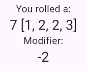

# Flutter D&D

My first Flutter project!

Below is a journal of my progress on this application.

## Roadmap
1. Can roll 4d6
1. Can roll stats
1. Can assign rolls to stats
1. Can choose to use standard array
1. Can save character(s) locally
1. Can save characters in remote DB
1. Add Unit Tests

I will be testing this app in Web/Android

## Resources
[Setup Guide](https://docs.flutter.dev/get-started/install/windows)

[Try Dart](https://dart.dev/#try-dart)

## Today I Learned
- Android Studio is by Jetbrains?! It's just like Rider.

## Setup Issues
Ran into a Gradle issue that I failed to track down. 

Recreating the project fixed the issue.

## V1

### Folders and Files
Studied the examples folder of the Flutter SDK for file layout standards but all it's code was in main.dart

[A Simple way to organize your code in Flutter](https://medium.com/@kanellopoulos.leo/a-simple-way-to-organize-your-code-in-flutter-e175e7004fb5)

I could not find an official recommendation so I'll be following this struture.

### Character Screen
This is just going to be a dice roller at first but will become where we view the character stats.

Got a reactive value to update. Learned that if we don't call setState as we change a value then the UI doesn't update. Seems quite different coming from ref/computed values in Vue.

I've now randomized the rolls using Math Random().nextInt and displayed the calculated bonus.

### V2
Added Ability class to our Character

Generating 6 of these with nothing stored on them. This will need to change when get to save/loading

Score is now calculated based on rolls. I don't like like the direct index references but I'm moving on for now.

### Cleanup
Naming standards? widget files camelCase? What libraries might I use to widgets/composables?
[Flutter’s recommended naming conventions for files and folders](https://medium.com/@parthbhanderi01/flutters-recommended-naming-conventions-for-files-and-folders-278fe8e09929)